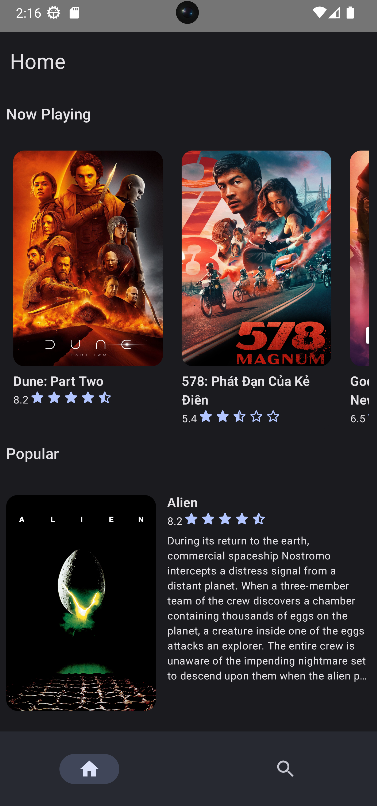

# Movie App 📱

This an offline first app that lists the popular, upcoming and playing now movies. The app gets data from [TMDB API](https://developer.themoviedb.org/reference/intro/getting-started).

The app uses MVVM architecture recommended by [Modern Android Development(MAD)](https://developer.android.com/series/mad-skills)

## Technologies

* [Jetpack Compose](https://developer.android.com/develop/ui/compose) - Jetpack Compose is Android’s recommended modern toolkit for building native UI.
* [Kotlin](https://kotlinlang.org/) - Kotlin is a programming language that makes coding concise and fun. It is Google's preferred language for Android app development.

## Libraries

* [Compose Navigation](https://developer.android.com/guide/navigation/get-started) - Android Jetpack's Navigation component helps you implement navigation.

* [Room](https://developer.android.com/training/data-storage/room) - A type-safe HTTP client for Android.

* [Hilt](https://developer.android.com/training/dependency-injection/hilt-android) - Hilt provides a standard way to incorporate Dagger dependency injection into an Android application.

* [Coil Compose](https://coil-kt.github.io/coil/) - An image loading library for Android backed by Kotlin Coroutines.

* [Gson](https://github.com/google/gson) -  A Java serialization/deserialization library to convert Java Objects into JSON and back.

## Showcase

| Home screen (Light)                      | Home screen (Dark)                    | Search screen(Light)                       | Search screen (Dark)                    |
|------------------------------------------|---------------------------------------|--------------------------------------------|-----------------------------------------|
|  |  |  |  |